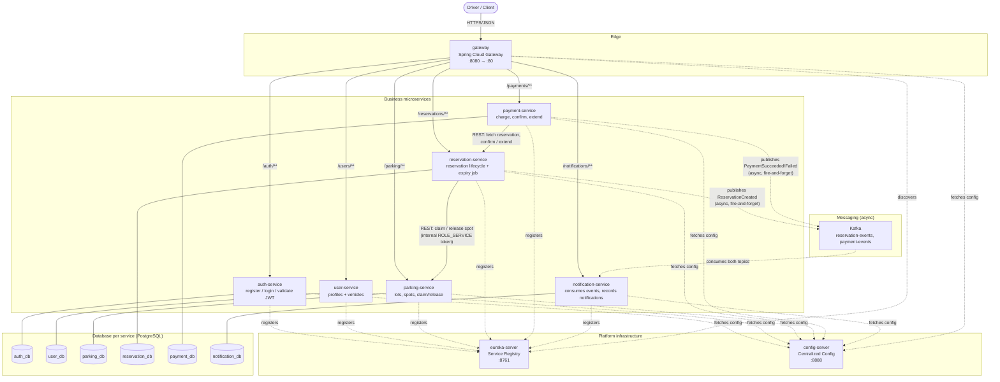
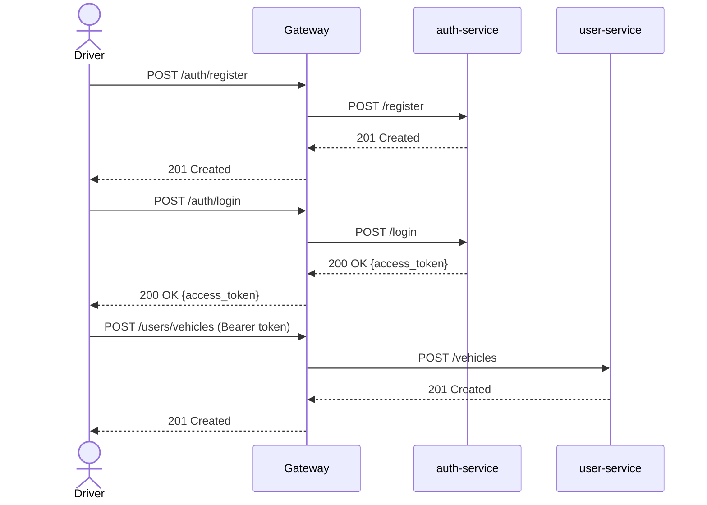
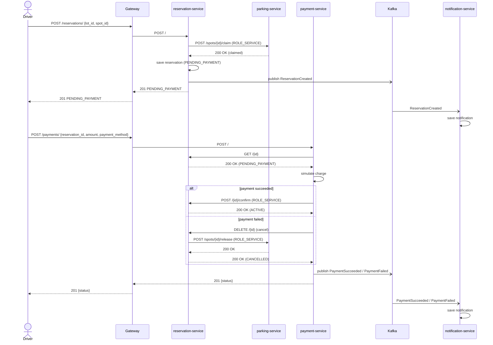
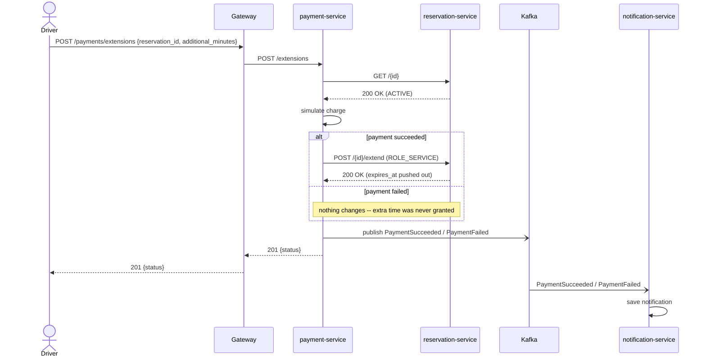
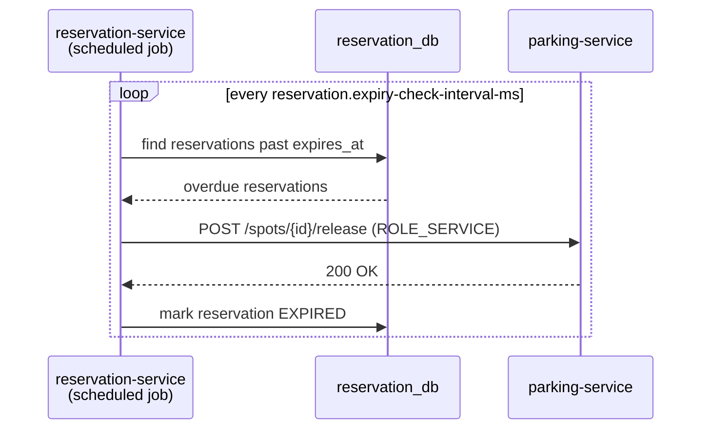
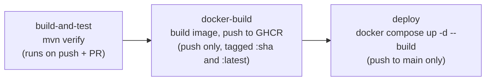

# Smart Parking System

## 1. Overview

Smart Parking System is a microservice-based parking reservation platform
built with Spring Boot and Spring Cloud. A driver registers, logs in,
registers a vehicle, browses parking lots and spots, reserves a spot, and
pays for it. The system is split into six business microservices (auth,
user, parking, reservation, payment, notification), each with its own
PostgreSQL database, backed by Spring Cloud platform infrastructure
(service discovery, centralized configuration, an API gateway) and Kafka
for asynchronous event delivery. Every component is containerized and
built/tested/deployed through a CI/CD pipeline.

See [section 4](#4-architecture--components) below for the full
architecture, process diagrams, and pipeline definition.

## 2. Running the Application

```bash
cd infra
docker compose up --build
```

This starts every service, reachable through the gateway at
`http://localhost`:

| Component | Address |
|---|---|
| gateway | `http://localhost` — routes `/auth`, `/users`, `/parking`, `/reservations`, `/payments`, `/notifications` |
| eureka-server | `http://localhost:8761` (dashboard) |
| config-server | `http://localhost:8888` (e.g. `/auth-service/default`) |
| kafka | `localhost:9092` (single-node, KRaft mode) |
| postgres-auth / -user / -parking / -reservation / -payment / -notification | `localhost:5432`–`5437` |

To run a single service against a local Postgres instead:

```bash
cd services/parking-service
mvn spring-boot:run
```

## 3. Quick Start

Each command below is a single line. If you're using bash, Git Bash, or
WSL, run them as-is. If you're using PowerShell, use `curl.exe` instead
of `curl`.

Register and log in:

```bash
curl -X POST http://localhost/auth/register -H "Content-Type: application/json" -d '{"email": "test@example.com", "password": "hunter2"}'

curl -X POST http://localhost/auth/login -H "Content-Type: application/json" -d '{"email": "test@example.com", "password": "hunter2"}'
# -> {"access_token": "...", "token_type": "bearer"}
```

Register a vehicle:

```bash
curl -X POST http://localhost/users/vehicles -H "Authorization: Bearer <access_token>" -H "Content-Type: application/json" -d '{"license_plate": "ABC-123", "make": "Toyota", "model": "Corolla"}'
```

Create a parking lot and a spot in it:

```bash
curl -X POST http://localhost/parking/lots -H "Authorization: Bearer <access_token>" -H "Content-Type: application/json" -d '{"name": "Downtown Garage", "address": "123 Main St"}'
# -> note the "id" in the response as <lot_id>

curl -X POST http://localhost/parking/lots/<lot_id>/spots -H "Authorization: Bearer <access_token>" -H "Content-Type: application/json" -d '{"spot_number": "A1"}'
# -> note the "id" in the response as <spot_id>
```

Make a reservation:

```bash
curl -X POST http://localhost/reservations/ -H "Authorization: Bearer <access_token>" -H "Content-Type: application/json" -d '{"lot_id": "<lot_id>", "spot_id": "<spot_id>", "duration_minutes": 30}'
# -> {"id": "...", "status": "PENDING_PAYMENT", "expires_at": "...", ...}
# -> note the "id" in the response as <reservation_id>
```

Pay for the reservation:

```bash
curl -X POST http://localhost/payments/ -H "Authorization: Bearer <access_token>" -H "Content-Type: application/json" -d '{"reservation_id": "<reservation_id>", "amount": 12.50, "payment_method": "visa"}'
# -> {"status": "SUCCEEDED", ...} -- the reservation is now ACTIVE
```

Check the reservation's status:

```bash
curl http://localhost/reservations/<reservation_id> -H "Authorization: Bearer <access_token>"
# -> {"status": "ACTIVE", "expires_at": "...", ...}
```

Check your notifications — populated asynchronously via Kafka by
`notification-service`, so allow a moment (usually well under a second)
after the reservation/payment calls above before this shows both events:

```bash
curl http://localhost/notifications/ -H "Authorization: Bearer <access_token>"
# -> [{"type": "RESERVATION_CREATED", "message": "...", ...}, {"type": "PAYMENT_SUCCEEDED", ...}]
```

## 4. Architecture & Components

### 4.1 Business Domain & Service Responsibilities

| Service | Responsibility | Owns data in |
|---|---|---|
| **auth-service** | Driver registration, login, JWT issuance and validation | `auth_db` |
| **user-service** | Driver profiles and registered vehicles | `user_db` |
| **parking-service** | Parking lots, parking spots, and spot availability | `parking_db` |
| **reservation-service** | Reservation lifecycle: create, list, cancel, expire, extend | `reservation_db` |
| **payment-service** | Charges for a new reservation or for extending an active one | `payment_db` |
| **notification-service** | Consumes `ReservationCreated`/`PaymentSucceeded`/`PaymentFailed` events from Kafka and records a notification for each | `notification_db` |

Platform infrastructure (no business data of its own):

| Service | Role |
|---|---|
| **eureka-server** | Service registry — every business service registers here and looks up the others by name |
| **config-server** | Centralized configuration — serves `infra/config-repo/*.yml` (datasource settings, JWT secret, gateway routes, business tunables) |
| **gateway** | Single entry point (Spring Cloud Gateway) — routes external traffic by path prefix, resolving destinations through Eureka |

**Business rules:**

- **Authentication**: `auth-service` is the only JWT issuer, signing with a
  secret shared via `config-server`; every other service only verifies.
- **Two token roles**: `ROLE_USER` (a driver's own token) and
  `ROLE_SERVICE` — a short-lived internal token `reservation-service` and
  `payment-service` mint for themselves when calling another service
  without a driver token in scope. Endpoints like `/spots/{id}/claim` and
  `/{id}/confirm`/`/{id}/extend` require `ROLE_SERVICE`, so a driver's own
  token can never reach them.
- **Reservation lifecycle**: creating a reservation claims a spot in
  `parking-service` and starts it as `PENDING_PAYMENT` (a short hold).
  Only `payment-service`'s `/{id}/confirm` promotes it to `ACTIVE`. An
  unpaid hold or an overdue `ACTIVE` reservation is auto-released by a
  scheduled job in `reservation-service`.
- **Payment outcomes**: `payment_method: "card_declined"` always fails (a
  deliberate test value). A declined initial payment cancels the
  reservation and releases the spot; a declined extension just leaves the
  reservation as it was.
- **Database-per-service**: each business service owns its own Postgres
  database.

### 4.2 System Architecture Diagram



**Notes on the diagram**

- Every direct service-to-service call (`reservation-service →
  parking-service`, `payment-service → reservation-service`) is
  synchronous REST, load-balanced client-side by resolving
  `lb://SERVICE-NAME` against Eureka — the only such calls in the system;
  everything else goes through the gateway or the Kafka broker.
- `reservation-service` and `payment-service` also publish events onto
  Kafka after their synchronous work succeeds or fails — asynchronous and
  fire-and-forget, with `notification-service` as the only consumer today.
  A Kafka outage never fails the driver's request.
- The gateway strips the routing prefix (`StripPrefix=1`) before
  forwarding, e.g. `GET /parking/lots` → `GET /lots` on `parking-service`.

### 4.3 Inter-Service Communication

| From | To | Style | Auth used |
|---|---|---|---|
| Driver | any service | Sync REST via gateway | Driver's own JWT |
| reservation-service | parking-service | Sync REST (claim/release) | Self-minted `ROLE_SERVICE` token |
| payment-service | reservation-service | Sync REST (fetch/cancel) | Driver's forwarded JWT |
| payment-service | reservation-service | Sync REST (`/confirm`, `/extend`) | Self-minted `ROLE_SERVICE` token |
| reservation-service | notification-service | **Async** (Kafka topic `reservation-events`) | n/a — event only |
| payment-service | notification-service | **Async** (Kafka topic `payment-events`) | n/a — event only |

Endpoints a driver must never reach directly (`/spots/{id}/claim`,
`/spots/{id}/release`, `/{id}/confirm`, `/{id}/extend`) require the
`ROLE_SERVICE` claim, minted only by `reservation-service` and
`payment-service` using the shared `jwt.secret`. The Kafka events carry no
auth — only `notification-service` reads those topics.

### 4.4 Security

- Stateless JWT authentication; `auth-service` is the only issuer.
- Every downstream service validates the JWT signature itself (shared
  secret from `config-server`) — no calls back to `auth-service`.
- Two roles: `ROLE_USER` for driver tokens, `ROLE_SERVICE` for internal,
  short-lived tokens minted by trusted services.

### 4.5 Process Flows (Swimlane Diagrams)

**Registration & login**



**Reserve a spot and pay** (the main business process)



**Extend an active reservation**



**Automatic expiry** (background job, no driver request involved)



### 4.6 Repository Layout

```
smart-parking-system/
├── services/
│   ├── eureka-server/                # service registry
│   ├── config-server/                # centralized config, serves infra/config-repo
│   ├── gateway/                      # Spring Cloud Gateway
│   ├── auth-service/                 # register / login / validate, JWT issuance
│   ├── user-service/                 # profiles + vehicles
│   ├── parking-service/              # parking lots and spot availability
│   ├── reservation-service/          # reservation lifecycle
│   ├── payment-service/              # payments
│   └── notification-service/         # consumes Kafka events, records notifications
├── infra/
│   ├── config-repo/                  # config-server's backing files
│   └── docker-compose.yml            # services + Postgres per service + Kafka
├── postman/                          # Postman collection for manual API testing
├── .github/workflows/build.yml       # CI/CD pipeline
└── README.md
```

### 4.7 CI/CD Pipeline

The pipeline is defined in [`.github/workflows/build.yml`](.github/workflows/build.yml)
(GitHub Actions), run per service via a build matrix, in three stages:



**Stage 1 — Build & Test** (every push and pull request)

```bash
mvn -B -f services/<service>/pom.xml verify
```

Runs unit tests (Mockito) and Testcontainers-backed integration tests
(`parking-service` against a real PostgreSQL container,
`notification-service` against a real Kafka broker). Surefire reports are
uploaded as build artifacts on failure. This stage runs on every PR and
every push to `main`, and never publishes or deploys by itself.

**Stage 2 — Containerize** (push to `main` only)

Each service's `Dockerfile` is built and pushed to GHCR, tagged with the
commit SHA and `:latest`:

```
ghcr.io/<owner>/<repo>/<service>:latest
ghcr.io/<owner>/<repo>/<service>:<commit-sha>
```

Images are only pushed on a `push` event, so a PR builds and tests without
publishing.

**Stage 3 — Deploy** (push to `main` only)

```bash
docker compose up -d --build --remove-orphans
```

Runs on a self-hosted runner — the "production" phase in this setup: a
push to `main` is the production branch, and the self-hosted runner is the
production host.

**Mapping pipeline stages to environments**

| Environment | Trigger | What runs | Where |
|---|---|---|---|
| **Development** | Feature branch, local machine | `mvn verify` for the changed service; `docker compose up` for the full stack | Local machine only |
| **CI / Pull Request** | PR against `main` | Stage 1 only | GitHub-hosted runner |
| **Production** | Push/merge to `main` | Stage 1 → 2 → 3 | GitHub-hosted runner (build) + self-hosted runner (deploy) |

To split this into a real staging/production setup, add a second deploy
target gated by environment approval (GitHub Environments) and point
`docker compose` (or Kubernetes) at that environment's own
`infra/config-repo` values — `config-server` already externalizes every
environment-specific setting, so no service code needs to change.

**Running tests locally**

```bash
mvn -f services/reservation-service/pom.xml verify   # one service
for s in services/*/; do mvn -B -f "$s/pom.xml" verify; done   # all
```

Testcontainers-based tests need a working Docker daemon — the same
requirement CI's runners already satisfy.

### 4.8 Configuration and Runtime Behavior

- **Config-server availability at startup**: `spring.config.import` is
  `optional:`, so a service that starts before `config-server` is actually
  reachable boots on its local `application.yml` defaults instead.
  For `gateway` this means no routes until it's restarted once
  `config-server` is up.
- **Eureka registration propagation**: a freshly registered service takes
  a few seconds to reach every other service's client-side load-balancer
  cache. A caller that resolves `lb://SERVICE-NAME` too soon sees a `503
  Service Unavailable` ("No instances available"); retrying once
  registration propagates resolves it.
- **Schema evolution**: `ddl-auto: update` creates tables and adds nullable
  columns automatically, but won't retrofit constraints or backfill
  non-nullable columns on tables that already have rows — that needs a
  manual `ALTER TABLE` (or, longer-term, Flyway/Liquibase migrations).
- **JSON naming for internal calls**: `LoadBalancerConfig` in
  `reservation-service`/`payment-service` injects the app's configured
  `ObjectMapper` into its `RestClient.Builder`, so internal calls
  serialize with the same `snake_case` convention as the public API.
- **Security and error dispatch**: `JwtAuthenticationFilter` in
  `parking-service`/`reservation-service` overrides
  `shouldNotFilterErrorDispatch()` so it still authenticates on Boot's
  internal `/error` forward — otherwise a `ROLE_SERVICE`-only denial would
  be re-evaluated as anonymous and reported as a misleading 401 instead of
  the real 403.
